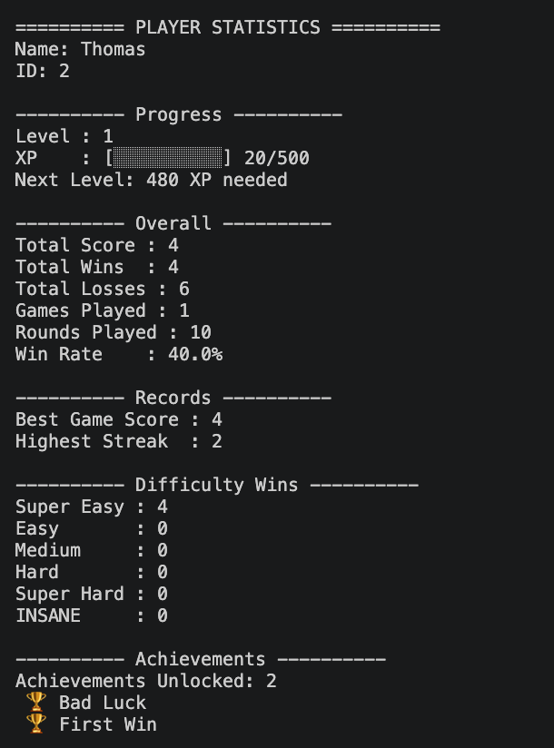
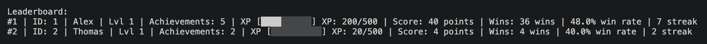

# Luck Game

## Gameplay Preview





## Description

Luck Game is an object-oriented Python project that started out as a simple number guessing game and eventually became a full player progression-based game with persistent data, achievements, XP, and leaderboards.

The project now uses a semi-modular object-oriented structure with separate components for gameplay logic, player management, difficulty systems, leaderboard management, save management, and JSON-based data persistence.

## Features

- Multiple difficulty stages
- Player profiles
- JSON-based data persistence
- XP and leveling system
- Achievement tracking system
- Leaderboard rankings
- Win streak and overall performance tracking
- Player statistics dashboard

## Project Structure

Python-OOP-Game/
│
├── src/
│   ├── Difficulty.py
│   ├── Game.py
│   ├── Player.py
│   ├── Leaderboard.py
│   ├── SaveManager.py
│   └── Start.py
│
├── images/
├── Legacy (full Game)/
├── players_example.json
├── README.md
├── LICENSE
└── .gitignore

## Architecture

The project was eventually refactored from a single-file implementation into a semi-modular structure to improve readability and to clearly delineate the responsibilities of each individual class.

- **Difficulty.py**: Stores difficulty settings, difficulty selection logic, and game parameters
- **Game.py**: Controls gameplay, rounds, scoring, and interactions between systems
- **Player.py**: Manages player profiles, statistics, XP, leveling, achievements, and player data serialization
- **Leaderboard.py**: Handles player rankings, searching, and score comparisons
- **SaveManager.py**: Handles JSON-based saving and loading of player data
- **Start.py**: Acts as the program entry point and manages menus, player login, and overall program flow

## Concepts Used

- Object-Oriented Programming (OOP)
- Classes and objects
- Encapsulation and class methods
- Modular software design
- Separation of concerns
- File handling
- JSON serialization/deserialization
- Data persistence

## How to Run

1. Clone the repository:

```bash
git clone <repository-url>
```

2. Navigate to the project folder:

```bash
cd Python-OOP-Game
```

3. Run the game from the entry point:

```bash
python3 src/Start.py
```

## Future Improvements

- Multiple game modes with unique mechanics
- Expanded achievement system
- Graphical user interface (GUI)
- Improved leaderboard functionality and ranking systems
- More detailed player analytics and statistics
- Additional save management features
